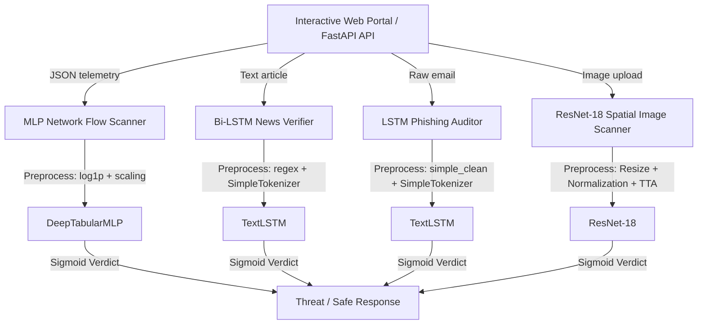

# MultiShield: Unified Multimodal Deep Learning System for Cybersecurity Threat Detection

> **MultiShield** is a zero-trust, local enforcement deep learning system that detects cybersecurity threats across multiple data modalities: network packets (tabular), articles (news text), email content (phishing text), and portrait captures (deepfake images).

[](LICENSE)
[](https://www.python.org/)
[](https://github.com/Manahil038/MultiShield-A-Unified-Multimodal-Deep-Learning-System-for-Cybersecurity-Threat-Detection-/actions)

---

## 📌 Project Overview & Motivation

Modern enterprise networks face diverse threat vectors. Standard pattern-matching firewalls miss modern semantic or generative threat vectors. **MultiShield** addresses this by hosting an integrated, sub-15ms local PyTorch enforcement runtime that classifies anomalies on:
1. **Network Flow Telemetry**: Detects DDoS, scans, and exploits using a 5-layer Multi-Layer Perceptron (MLP) trained on UNSW-NB15.
2. **Text Narrative Integrity**: Filters fake news and context fabrications using a Bidirectional LSTM.
3. **Phishing Messaging**: Identifies social engineering urgency indicators and credentials spoofing.
4. **Spatial visual artifacts**: Exposes Generative adversarial networks (StyleGAN2) face blends using ResNet-18 convolution feature analysis.

---

## ⚙️ System Architecture

MultiShield features a modular preprocessing and inference pipeline that links our local PyTorch model check-points directly to an interactive FastAPI dashboard server:



---

## 🚀 Installation & Quick Start

### 📋 Prerequisites
* Python 3.11 (configured with pip)
* CUDA-compatible GPU (optional, fallbacks to CPU automatically)

### 🛠️ Setting up locally

1. **Clone the Repository**
   ```bash
   git clone https://github.com/Manahil038/MultiShield-A-Unified-Multimodal-Deep-Learning-System-for-Cybersecurity-Threat-Detection-.git
   cd MultiShield-A-Unified-Multimodal-Deep-Learning-System-for-Cybersecurity-Threat-Detection-
   ```

2. **Establish Environment & Install Dependencies**
   ```bash
   python -m venv .venv
   source .venv/bin/activate  # On Windows use: .venv\Scripts\activate
   pip install -r requirements.txt
   ```

3. **Verify Installation & Run Tests**
   ```bash
   python -m pytest tests/ -v
   ```

4. **Launch the FastAPI Server Portal**
   ```bash
   python app.py
   ```
   *Navigate to `http://localhost:8000` to interact with the MultiShield core dashboard.*

5. **Test the Detections (Demonstration)**
   You can easily test the models on the local dashboard by using the ready-made samples provided in the `unified_samples/` directory. It contains real/fake photos, text samples, and network parameters for all scenarios.

---

## 🐳 Containerization with Docker

You can run the entire MultiShield runtime containerized using Docker:

```bash
# Build the Docker image
docker build -t multishield-core .

# Run the container mapping port 8000
docker run -p 8000:8000 multishield-core
```

---

## 📊 Summary of Model Performance

Detailed test-set metrics evaluated over 3 seeds:

| Modality | Model | Training Subset | Accuracy | Latency (Inference) |
|---|---|---|---|---|
| **Tabular (UNSW-NB15)** | DeepTabularMLP | 100,000 rows | **~91.5%** | < 1.5ms |
| **Fake News (Text)** | TextLSTM (Bi-LSTM) | 20,000 articles | **~96.2%** | < 8.2ms |
| **Phishing Email (Text)** | TextLSTM (Bi-LSTM) | 25,000 emails | **~94.8%** | < 7.8ms |
| **Deepfake Image** | ResNet-18 (DLR/GU) | 20,000 images | **~93.4%** | < 14.5ms (with TTA) |

---

## 📂 Codebase Directory Layout

```
MultiShield/
├── .github/workflows/       # GitHub Actions CI testing workflows
├── data/                    # Dataset ZIP files (BOM notes & provenance)
├── unified_samples/         # Ready-to-use sample files & parameters for UI demonstrations
├── docs/                    # In-depth architectural & deployment guides
│   ├── ARCHITECTURE.md      # Detailed deep learning architecture review
│   ├── DATA.md              # Consolidated dataset cards documentation
│   ├── DEPLOYMENT.md        # Local virtual environments & Docker guides
│   └── RESULTS.md           # Model performance evaluations & ablations
├── experiments/             # Config files, optuna DBs, baseline logs
├── notebooks/               # Exploratory EDA and dataset downloading
├── src/                     # Modular source code
│   ├── data/                # Dataloaders and splitting functions
│   ├── models/              # PyTorch deep architectures definitions
│   ├── preprocessing/       # Modality-specific preprocessors
│   ├── training/            # Custom PyTorch training loops & schedulers
│   └── utils/               # Device detection, seeding, and help utilities
├── static/                  # Vanilla CSS/JS client frontend UI dashboard
├── tests/                   # Pytest automation test suite
├── Dockerfile               # Container build script
├── CITATION.cff             # Citation configuration
└── LICENSE                  # MIT License
```

---

## 📝 Citation

If you use this system or its configurations in your research, please cite our repository as follows:

```bibtex
@software{MultiShield2026,
  author = {Ahmed, Hanzala and Fatima, Manahil and Ahmad, Uzair},
  title = {MultiShield: A Unified Multimodal Deep Learning System for Cybersecurity Threat Detection},
  version = {1.0.0},
  year = {2026},
  url = {https://github.com/Manahil038/MultiShield-A-Unified-Multimodal-Deep-Learning-System-for-Cybersecurity-Threat-Detection-}
}
```

---

## ⚖️ License
This project is licensed under the [MIT License](LICENSE) - see the file for details.
